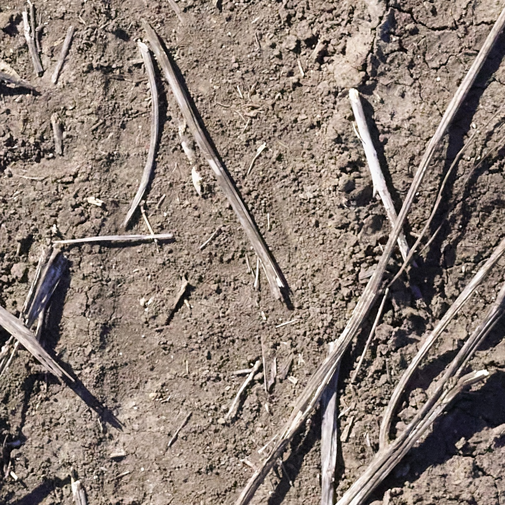
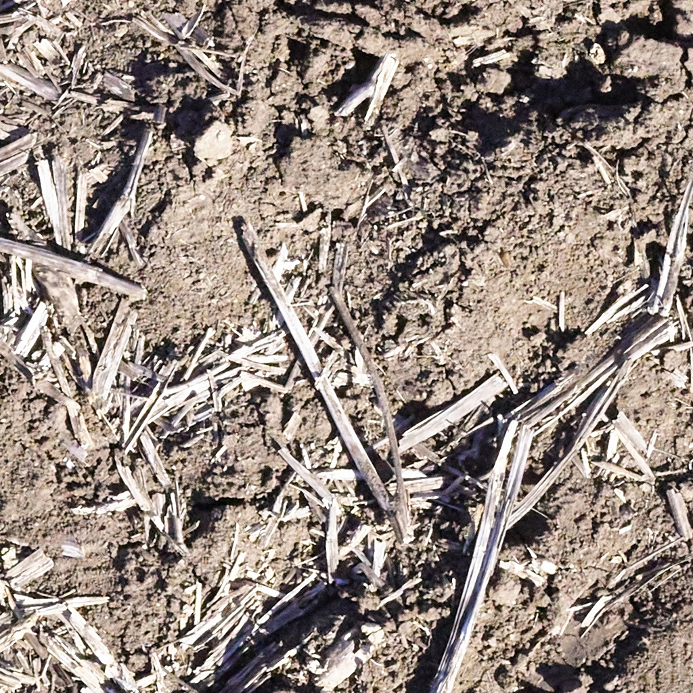
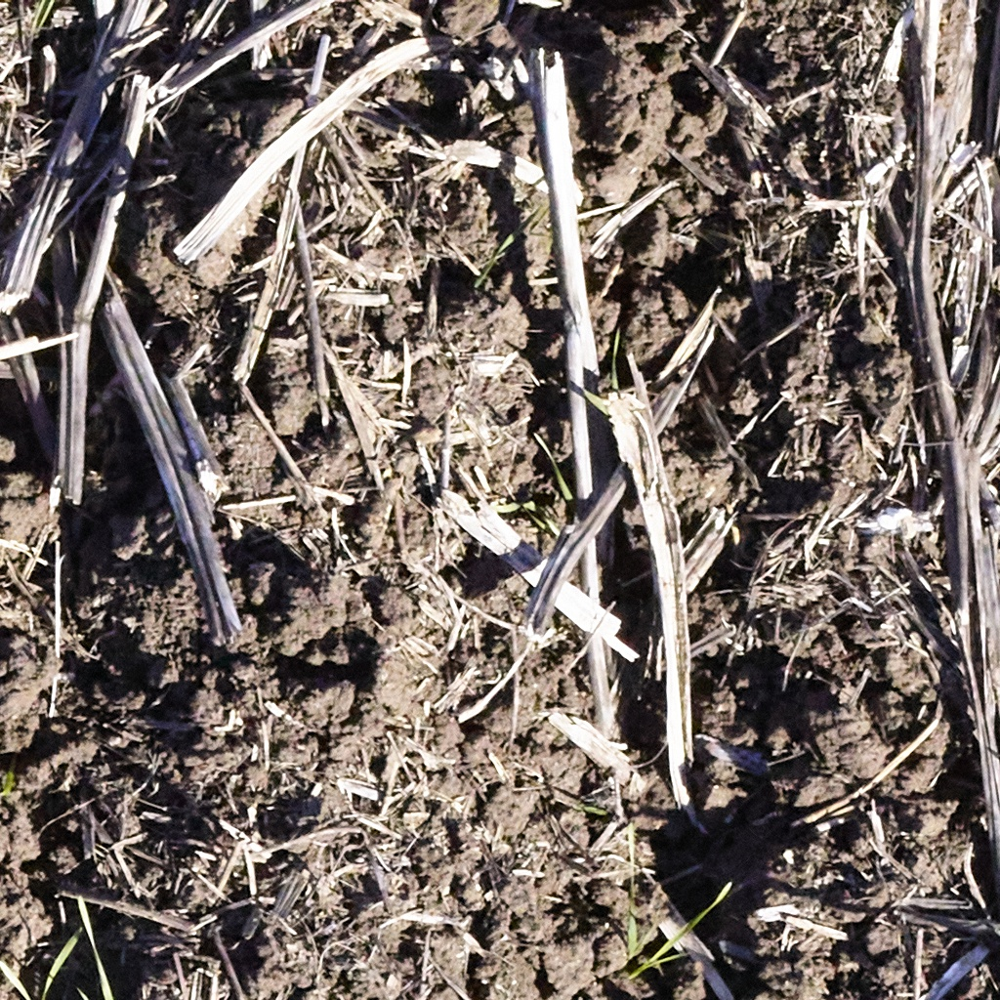
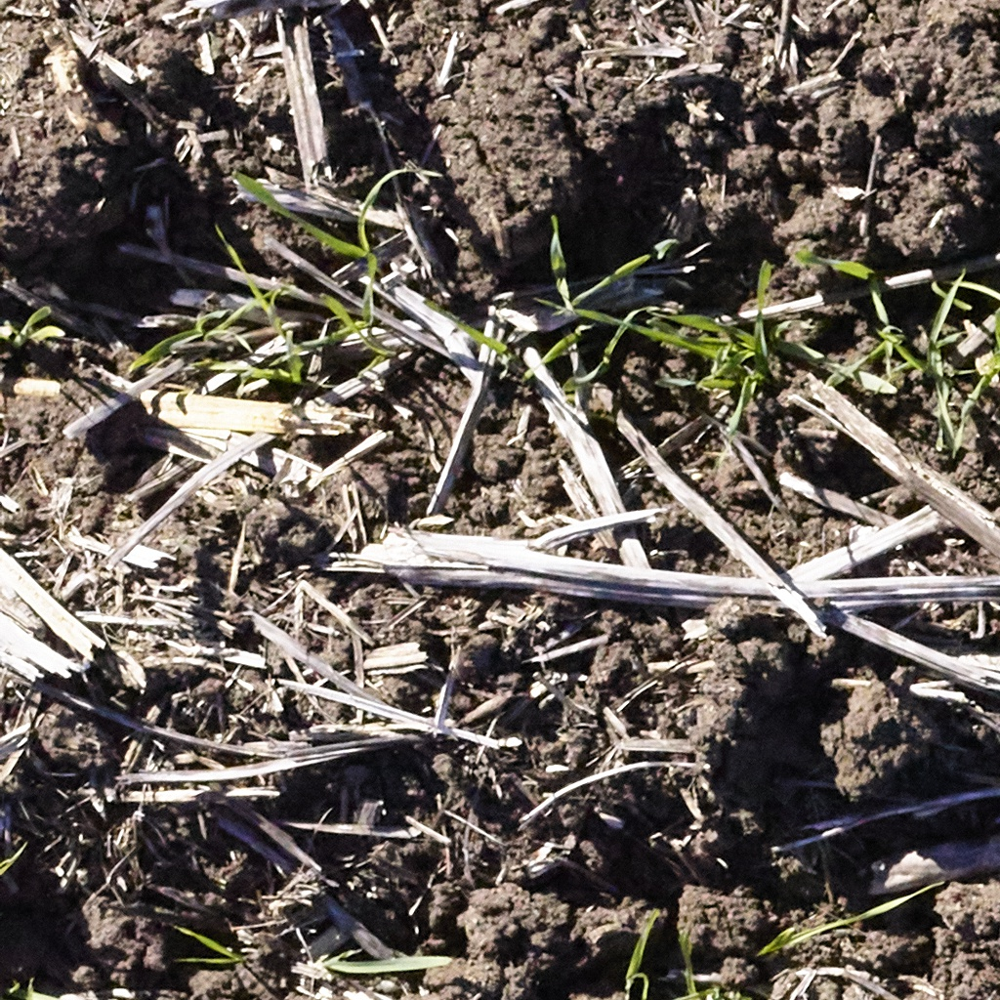
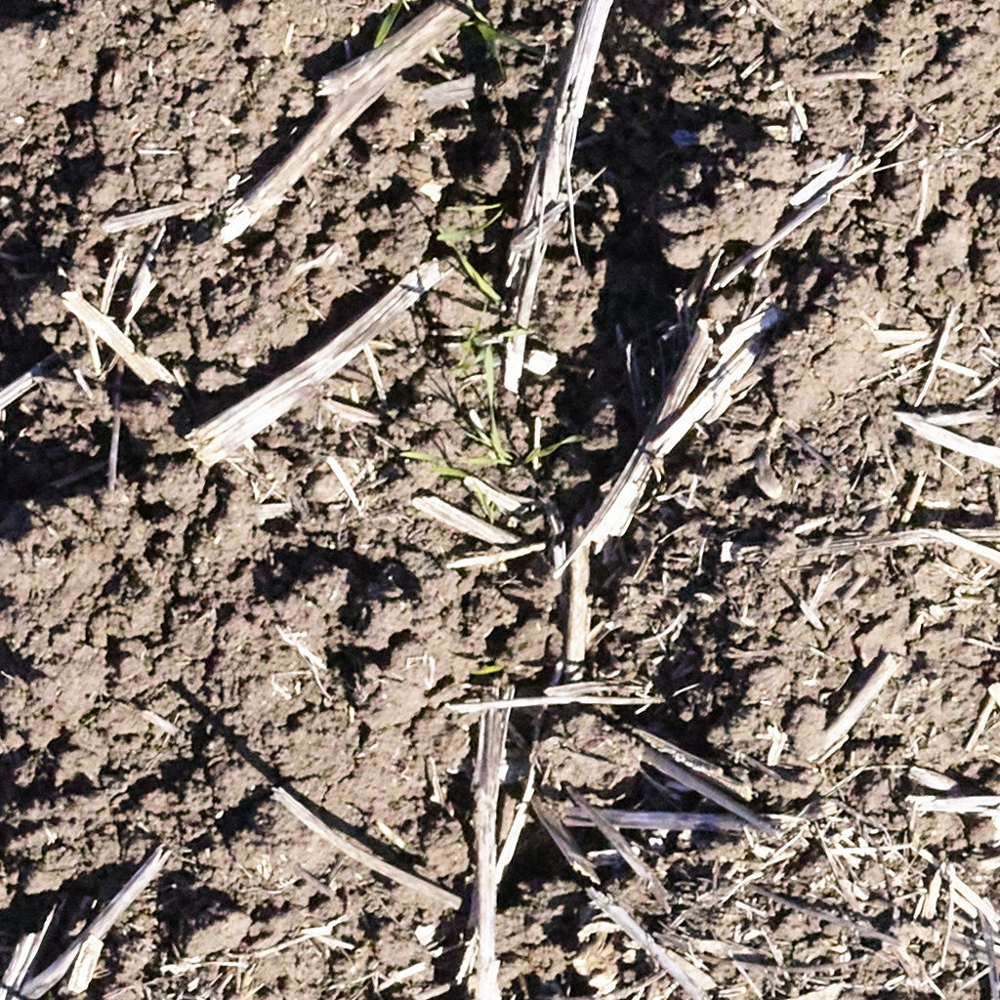
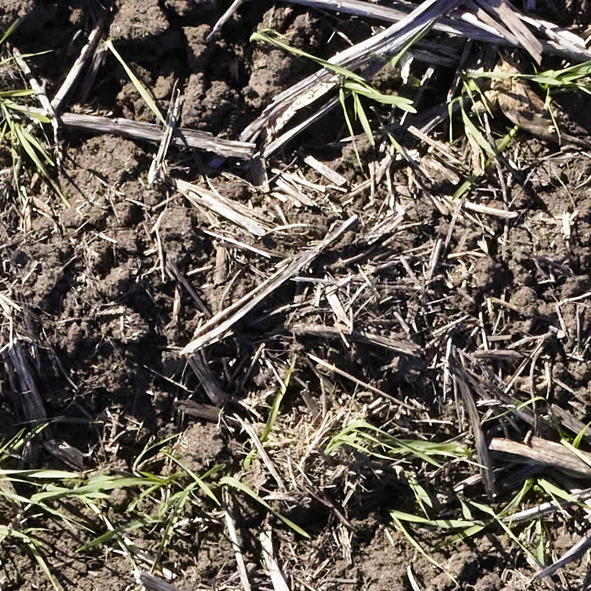
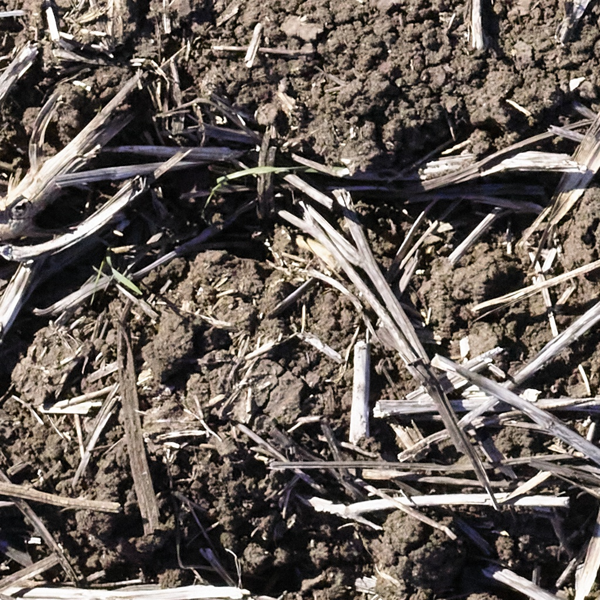
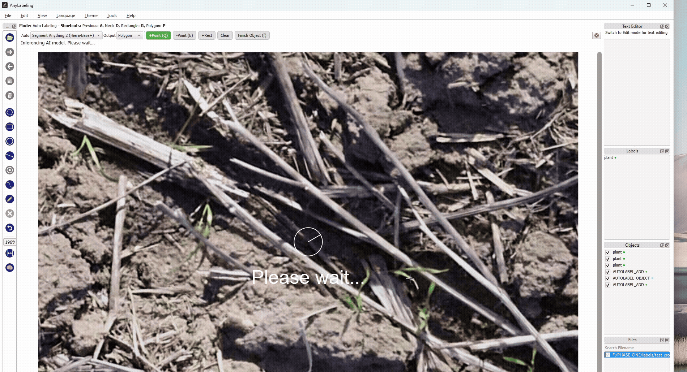
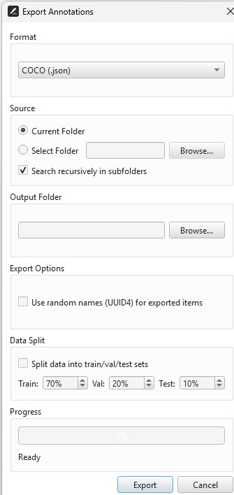

# Barley Seedling Segmentation
# Note this is just a quick repo for an SOP.
Prepare training data for barley **seedling segmentation** models.

The raw field captures are very large (~122 megapixel) RGB JPGs, which are far
too big to feed directly into a segmentation network. This repo holds the
tooling to turn those big images into small, fixed-size **tiles** that are
convenient to annotate and train on.

---

## Repository layout

```text
Barley_Seedling_Segmentation/
├── README.md
├── MEDIA/                              # stable copies of example tiles (used in this README)
├── scripts/
│   └── tile_random_subset.py           # sample + tile the source imagery
└── USYD_20250705/
    ├── processed_JPG_subset/           # input: full-size source JPGs
    └── tiled_imgs/                     # output: generated 1024×1024 tiles (regenerated each run)
```

---

## What the tiling does

A segmentation model trains on small, fixed-size image patches — not on a
single ~122 MP photo. The tiling step slices the large source images into
**1024 × 1024 pixel squares** so they can be annotated and used for training.

The helper script [`scripts/tile_random_subset.py`](scripts/tile_random_subset.py)
is deliberately a **lightweight sampler** for quick inspection and annotation,
rather than an exhaustive "tile everything" tool. On each run it:

1. Picks **N random images** (default `10`) from `processed_JPG_subset/`.
2. Crops **one random, grid-aligned `1024 × 1024` tile** from each chosen image.
   Tiles snap to a regular grid (`col × 1024`, `row × 1024`), so every tile lines
   up with the image's tile grid rather than being an arbitrary off-grid crop.
3. Saves the tiles into `tiled_imgs/`, clearing any previous tiles first so each
   run starts clean (pass `--no-clean` to keep them).

Other details worth knowing:

- A **fixed random seed** (`7`) makes a bare run reproducible — you get the same
  sample/tiles every time unless you pass `--seed`.
- Images are converted to **RGB** and written as JPEGs at quality `95`.
- Output files are named `<source-stem>_tile_c<col>_r<row>.jpg`, so the
  filename records which source image and which grid cell each tile came from.
- Pillow's decompression-bomb guard is lifted because these large camera images
  are trusted.

### Usage

```bash
# From the repository root — reproducible run with all defaults
python scripts/tile_random_subset.py

# Sample 10 images with an explicit seed
python scripts/tile_random_subset.py --n-images 10 --seed 42

# Custom input/output folders and tile size
python scripts/tile_random_subset.py \
    --input  USYD_20250705/processed_JPG_subset \
    --output USYD_20250705/tiled_imgs \
    --tile-size 1024

# See all options
python scripts/tile_random_subset.py --help
```

> **Note:** `tiled_imgs/` is wiped and regenerated on every run. The example
> tiles shown below are kept in `MEDIA/` so this README always has stable images
> to display.

---

## Example tiles

A random `1024 × 1024` tile sampled from each of the source images
(seed `7`). The filename encodes the source image and its grid position
(`c` = column, `r` = row).

<table>
  <tr>
    <td align="center">
      <br>
      <sub><code>P0032725</code> · col 6, row 6</sub>
    </td>
    <td align="center">
      <br>
      <sub><code>P0032923</code> · col 8, row 3</sub>
    </td>
    <td align="center">
      <br>
      <sub><code>P0033111</code> · col 9, row 0</sub>
    </td>
  </tr>
  <tr>
    <td align="center">
      <br>
      <sub><code>P0033257</code> · col 0, row 1</sub>
    </td>
    <td align="center">
      <br>
      <sub><code>P0033489</code> · col 1, row 3</sub>
    </td>
    <td align="center">
      <br>
      <sub><code>P0033705</code> · col 6, row 0</sub>
    </td>
  </tr>
  <tr>
    <td align="center">
      <br>
      <sub><code>P0033707</code> · col 1, row 8</sub>
    </td>
    <td></td>
    <td></td>
  </tr>
</table>

---

## Annotating the tiles

These tiles are only the raw inputs — to train a segmentation model each tile
still needs to be **annotated** (the seedlings outlined/masked) to provide the
ground-truth labels the model learns from.

The GIF below is from a **wheat** dataset (not barley), but it demonstrates
the workflow: [AnyLabeling](https://github.com/vietanhdev/anylabeling) uses
**SAM (Segment Anything Model)** to speed up annotation — a click or box prompt
generates a mask automatically instead of hand-tracing every seedling.

<p align="center">
  <br>
  <sub>SAM-assisted annotation in AnyLabeling (chickpea example).</sub>
</p>

---

## Exporting the annotations

Once the seedlings are masked, export the labels so they can be used to train a
model. The screenshot below shows how to export the annotations from
AnyLabeling.

<p align="center">
  <br>
  <sub>Exporting annotations from AnyLabeling.</sub>
</p>

> **Note:** the train / validation / test split will be sorted once all the
> training data has been pooled.


